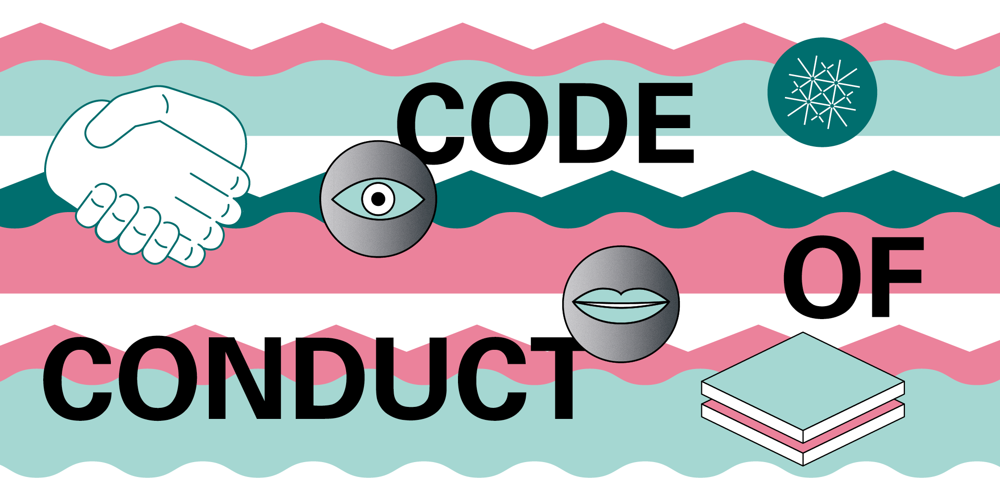

# Course Addenda

Perspektiven der Digitalen Musikwissenschaft

## Info

#### Instructors
* Email: stefan.muennich(at)unibas.ch

* Schedule/meeting info: [https://vorlesungsverzeichnis.unibas.ch/de/vorlesungsverzeichnis?id=293650](https://vorlesungsverzeichnis.unibas.ch/de/vorlesungsverzeichnis?id=293650)

Please read this addendum to the general course outline carefully. It is your guide to the course requirements and activities.

Please refer to the course outline for learning outcomes, course description and text and materials. 

Please also visit [AI in learning and teaching](https://www.unibas.ch/en/Studies/Learning-and-Teaching/AI-in-learning-and-teaching.html) for key information about guidelines from the University of Basel for the use of AI-based tools.

## Course Policy

In order to pass the course you need to:

* regularly and actively participate.
* engage with the assignments.
* give a 10 minute short presentation on a content-related topic.
* write a brief essay (and re-essay).
* miss max. 3 times with excuse.

## Time line

| Week | Topics | Readings | |
|---|---|---|---|
| week 1 | Organization // What is Digital Musicology? | | |
| week 2 | Data in Musicology | | |
|break week | Fasnacht
| week 3 | Music Encoding and Digital Editions | | |
| week 4 | Optical Music Recognition (OMR) | | |
| week 5 | Music Information Retrieval (MIR) | | |
| week 6 | Computer-Assisted Music Analysis | | |
|break week | Easter
| week 7 | Critical Perspectives on Digital Methods / Use of AI (Part 1) | | |
|break week | Labor Day
| week 8 | Critical Perspectives on Digital Methods / Use of AI (Part 2) | | |  
| week 9 | Digital Musicology Using the Example of the Eurovision Song Contest | | |
| week 10 | Summary and Final Discussion | | |

## Resources

### XML editors

XML files can be opened and edited with any text editor. The most widely used and with specific support for TEI currently are:
- [oXygen](https://www.oxygenxml.com/) (licensed)
- [Visual Studio Code](https://code.visualstudio.com/) (free). How to use VSCode for [XML and TEI encoding](http://phc.uni.wroc.pl/interreg/w/losada/VSCode.html)

#### Recommended VSCode extensions
 * [GitHub Classroom](https://marketplace.visualstudio.com/items?itemName=GitHub.classroom)
 * [GitLens](https://marketplace.visualstudio.com/items?itemName=eamodio.gitlens)
 * [GitHub Pull Requests and Issues](https://marketplace.visualstudio.com/items?itemName=GitHub.vscode-pull-request-github)
 * [Scholarly XML](https://marketplace.visualstudio.com/items?itemName=raffazizzi.sxml)
 * [tei-publisher-vscode](https://github.com/eeditiones/tei-publisher-vscode)
 * [XML Tools](https://marketplace.visualstudio.com/items?itemName=DotJoshJohnson.xml)
 * [xslt-transform](https://marketplace.visualstudio.com/items?itemName=SvenAGN.xslt-transform)
 * [vscode-pdf](https://marketplace.visualstudio.com/items?itemName=tomoki1207.pdf)
 

## Code of Conduct

[Code of Conduct Uni Basel](https://www.unibas.ch/de/Universitaet/Administration-Services/Vizerektorat-People-And-Culture/Culture-Diversity-und-Leadership-Development/Personal-Integrity/Code-of-Conduct.html)

